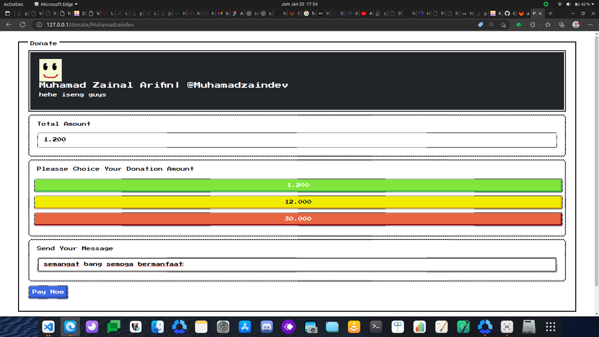

# Retro Donation with Retro Style

<p align="center">
  <a href="https://laravel.com/">
    
  </a>
</p>

> (Open Source Project) Simple application for creating donation integrated with midrans payment gateway

---

## Table of contents

-   [Table of contents](#table-of-contents)
-   [Prerequiste](#prerequiste)
-   [Stacks](#stacks)
-   [Installation and Cofiguration](#installation)
-   [Screen Capture](#capture)

## Prerequiste

-   [Composer](https://getcomposer.org/) - Download and Install Composer
-   Docker

## Stacks

-   PHP 8
-   Laravel 9
-   Bootstrap 5
-   Nes.css
-   Select2
-   Ubuntu (Base Image)
-   Nginx (Running in Container)
-   Sail (Laravel Library Docker development environment)
-   PostgreSQL running inside Container

## Installation

1. Clone repository

```bash
$ git clone https://github.com/Zainal21/retro-donation.git
```

2. move to directory project and Install depedencies

```bash

$ cd retro-donation

$ Composer install
```

3. Setup your environment variabl in `.env` files or rename `.env.example to .env`.

4. pull image & run image then Generate your application key

```bash
$  ./vendor/bin/sail up -d
```

```bash
$ ./vendor/bin/sai artisan key:generate
```

5. Run Migration and Seeder (if you not import .sql file manually)

```bash
$ ./vendor/bin/sai artisan migrate --seed
```

## Screen Capture Result

-   Dashboard
    
-   Donation Page
    
-   Confirm Donation
    
-   Payment/Send Donation
    

---

Copyright © 2023 by Muhamad Zainal Arifin

> The Project is Under MIT licensed.
